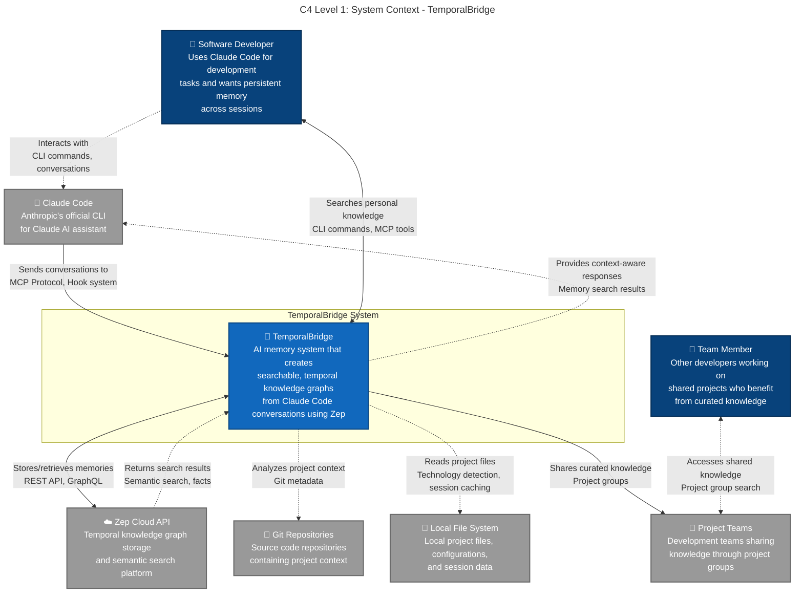

## User Graph Architecture
- **Personal conversations in user graph** - All conversations stored under single developer ID
- **Manual knowledge curation to project groups** - Deliberate sharing prevents noise
- **Cross-project learning and expertise tracking** - Personal patterns span multiple projects
- **Technology detection and relationships** - Automatic project entity creation

## Knowledge Storage Features
- **Semantic embeddings for conversations** - AI-powered search capabilities
- **Entity-relationship graphs** - Connected knowledge representation
- **Temporal indexing and search** - Time-aware memory retrieval
- **Cross-encoder reranking** - Advanced relevance scoring