```mermaid
---
title: "C4 Level 2: Container - TemporalBridge System"
---
flowchart TB
    %% External Actors & Systems
    DEV[👤 Software Developer<br/>Uses Claude Code with TemporalBridge<br/>for persistent AI memory]
    CLAUDE[🤖 Claude Code<br/>Anthropic's official CLI for Claude]
    ZEP[☁️ Zep Cloud API<br/>Knowledge graph storage platform]
    GIT[📂 Git Repositories]
    FS[💾 Local File System]
    
    %% TemporalBridge System
    subgraph TB_SYSTEM["🧠 TemporalBridge System"]
        CLI[🖥️ TemporalBridge CLI<br/>Node.js, NestJS<br/>Command-line interface for direct<br/>memory operations and project management]
        
        MCP[🔌 MCP Server<br/>Node.js, NestJS, @rekog/mcp-nest<br/>Model Context Protocol server providing<br/>memory tools to Claude Code]
        
        HOOK[🪝 Claude Code Hook<br/>File-based integration<br/>Automatically captures Claude Code<br/>conversations and stores them in user graph]
        
        CACHE[(💾 Session Cache<br/>YAML files<br/>Caches project entities, technology<br/>detection results, and session metadata)]
        
        CONFIG[(⚙️ Configuration<br/>JSON, YAML<br/>MCP configuration, environment<br/>settings, and project metadata)]
    end
    
    %% External Relationships
    DEV <-.->|"Uses<br/>CLI commands"| CLAUDE
    DEV <-->|"Uses directly<br/>CLI commands"| CLI
    CLAUDE <-->|"Calls<br/>MCP protocol, stdio transport"| MCP
    CLAUDE -.->|"Triggers<br/>Conversation hooks"| HOOK
    
    %% Internal Relationships - API Calls
    CLI <-->|"Stores/searches<br/>REST API"| ZEP
    MCP <-->|"Stores/searches<br/>REST API"| ZEP
    HOOK -->|"Stores conversations<br/>REST API"| ZEP
    
    %% Internal Relationships - File I/O
    CLI <-->|"Reads/writes<br/>File I/O"| CACHE
    MCP -.->|"Reads<br/>File I/O"| CACHE
    HOOK -->|"Updates<br/>File I/O"| CACHE
    
    CLI -.->|"Reads<br/>File I/O"| CONFIG
    MCP -.->|"Reads<br/>File I/O"| CONFIG
    
    %% Project Analysis
    CLI -.->|"Analyzes<br/>Git commands"| GIT
    CLI -.->|"Scans<br/>File system API"| FS
    
    %% Data Flow Back
    MCP -.->|"Returns<br/>Memory search results"| CLAUDE
    CLI -.->|"Displays<br/>Search results, project info"| DEV
    
    %% Styling
    classDef container fill:#1168bd,stroke:#0b4884,stroke-width:2px,color:#fff
    classDef external fill:#999,stroke:#6b6b6b,stroke-width:2px,color:#fff
    classDef person fill:#08427b,stroke:#052e56,stroke-width:2px,color:#fff
    classDef database fill:#2e7d32,stroke:#1b5e20,stroke-width:2px,color:#fff
    
    class CLI,MCP,HOOK container
    class CLAUDE,ZEP,GIT,FS external
    class DEV person
    class CACHE,CONFIG database
```

## MCP Server Tools (11 Available)
- **`search_personal`** - Personal memory search
- **`search_project`** - Project knowledge search  
- **`search_all`** - Combined search with source labels
- **`share_knowledge`** - Curate insights to project groups
- **`get_recent_episodes`** - Conversation context retrieval
- **`list_projects`** - Project portfolio overview
- **`project_context`** - Current project information
- **`get_technology_expertise`** - Skill analysis across projects
- **`project_technologies`** - Technology breakdown per project
- **`get_current_context`** - Session context management
- **`get_thread_context`** - Thread-specific analysis

## Automatic Hook Capture
- **All Claude Code conversations** - Seamless integration
- **Project context detection** - Automatic metadata enrichment
- **Technology relationship mapping** - Entity-relationship graphs
- **Session linking to projects** - Conversation-project associations

## Session Cache Benefits
- **Project entity detection results** - Avoid reprocessing
- **Technology confidence scores** - Performance optimization
- **Session-project relationships** - Context persistence
- **Performance metrics** - Analysis and debugging
- **Processing timestamps** - Freshness tracking