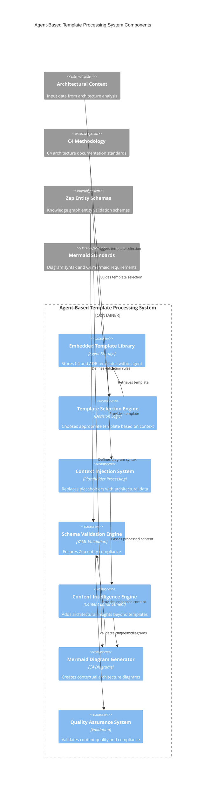

# Agent-Based Template Processing System Container Components

## Component Overview
The Agent-Based Template Processing System provides intelligent template management and content generation within the TemporalBridge documentation generator agent. It evolves beyond simple placeholder substitution to offer contextual content creation, schema validation, and quality assurance for C4 architecture documentation generation.

## Architectural Components (Major functional areas)

### **Embedded Template Library**
- **Responsibility**: Stores and manages C4 templates (L1, L2, L3) and ADR templates within the documentation generator agent
- **Technology**: Agent-embedded template storage with versioned template management
- **Interfaces**: Template retrieval, template versioning, template metadata management

### **Template Selection Engine**
- **Responsibility**: Chooses appropriate template based on C4 layer, document type, and architectural context
- **Technology**: Decision logic engine with template matching algorithms
- **Interfaces**: Selection criteria processing, template matching, fallback template handling

### **Context Injection System**
- **Responsibility**: Replaces template placeholders with architectural context and detected values from git analysis
- **Technology**: Advanced placeholder processing with context validation and transformation
- **Interfaces**: Context parsing, placeholder replacement, variable transformation, context validation

### **Schema Validation Engine**
- **Responsibility**: Ensures all generated documents have proper YAML frontmatter and Zep entity compliance
- **Technology**: YAML schema validation with entity type enforcement and metadata verification
- **Interfaces**: Schema validation, entity compliance checking, frontmatter generation, metadata validation

### **Content Intelligence Engine**
- **Responsibility**: Enhances basic template content with architectural insights beyond simple placeholder substitution
- **Technology**: Contextual content generation with architectural pattern recognition and insight synthesis
- **Interfaces**: Content enhancement, architectural insight generation, pattern recognition, content enrichment

### **Mermaid Diagram Generator**
- **Responsibility**: Creates contextual C4 diagrams based on architectural understanding and component relationships
- **Technology**: Mermaid syntax generation with C4 methodology compliance and relationship mapping
- **Interfaces**: Diagram generation, relationship mapping, C4 syntax compliance, visual representation

### **Quality Assurance System**
- **Responsibility**: Validates generated content for consistency, accuracy, C4 compliance, and best practices
- **Technology**: Multi-stage validation with content analysis, consistency checking, and quality metrics
- **Interfaces**: Content validation, consistency checking, quality scoring, compliance verification

## Component Diagram

## Component Interactions
The template processing workflow begins when the Template Selection Engine receives architectural context and selects the appropriate template from the Embedded Template Library. The Context Injection System processes placeholders with architectural data, which the Content Intelligence Engine enhances with insights beyond basic substitution. The Mermaid Diagram Generator creates contextual C4 diagrams based on component relationships, while the Schema Validation Engine ensures Zep entity compliance throughout. Finally, the Quality Assurance System validates the complete generated content for consistency, accuracy, and best practices compliance. This sequential processing approach with multiple validation stages ensures high-quality, contextually appropriate documentation generation that maintains both C4 methodology standards and knowledge graph integration requirements.