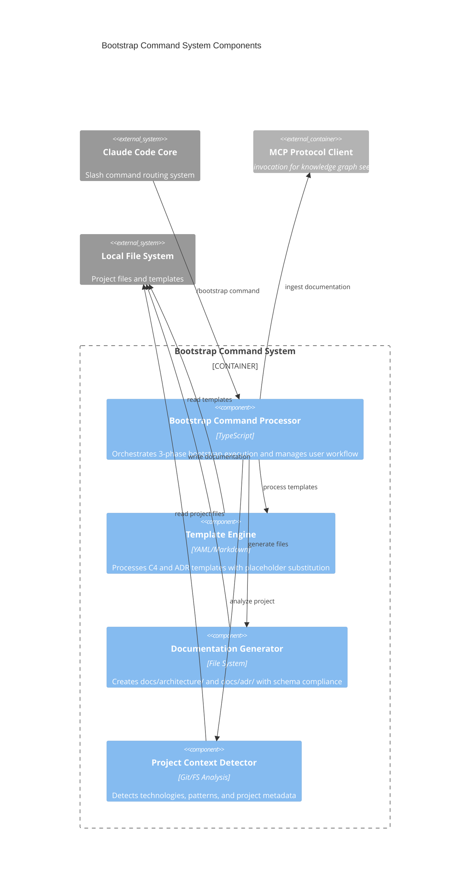
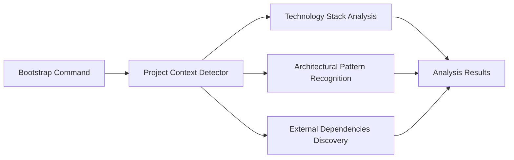
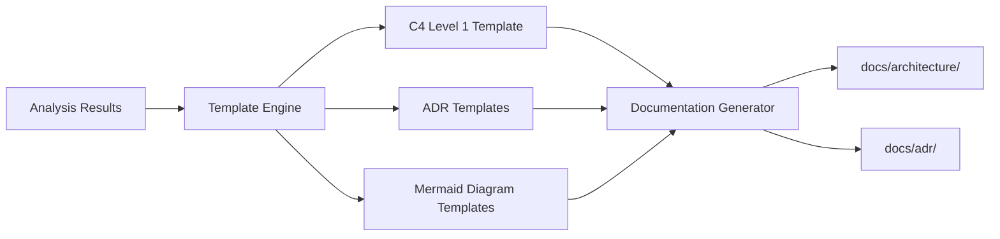
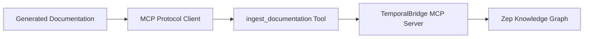

# Bootstrap Command System Components

## Component Overview
The Bootstrap Command System implements a 3-phase architecture initialization pipeline that processes `/bootstrap` slash commands to generate comprehensive project documentation and seed the knowledge graph with foundational architecture information.

## Architectural Components (Major functional areas)

### **Bootstrap Command Processor**
- **Responsibility**: Orchestrates the complete bootstrap workflow execution
- **Technology**: Node.js, TypeScript
- **Interfaces**: Slash command handler, workflow coordinator, user interaction manager

### **Template Engine**
- **Responsibility**: Processes C4 and ADR templates with variable substitution
- **Technology**: YAML, Markdown, templating system
- **Interfaces**: Template loader, placeholder processor, schema validator

### **Documentation Generator**
- **Responsibility**: Creates documentation files with proper directory structure
- **Technology**: File System API, atomic operations
- **Interfaces**: File writer, directory manager, content assembler

### **Project Context Detector**
- **Responsibility**: Analyzes project structure and technology stack
- **Technology**: Git analysis, file system scanning, pattern matching
- **Interfaces**: Technology detector, confidence scorer, metadata extractor

## Component Diagram

## Component Interactions

### **3-Phase Processing Pipeline**

#### **Phase 1: Project Discovery**
The **Project Context Detector** performs comprehensive project analysis:

**Key Operations:**
- Git repository analysis for metadata
- Package.json and dependency scanning
- File extension pattern matching
- Framework and tool detection
- Confidence scoring for detected technologies

#### **Phase 2: Documentation Generation**
The **Template Engine** and **Documentation Generator** create architecture documents:

**Key Operations:**
- Variable substitution in templates (`{{ placeholder }}`)
- YAML frontmatter validation for entity schema compliance
- Mermaid diagram generation with project-specific data
- Atomic file creation with proper directory structure

#### **Phase 3: Knowledge Graph Bootstrap**
The system integrates with MCP tools for knowledge graph seeding:

**Key Operations:**
- Document ingestion through MCP protocol
- Entity creation for Architecture and ArchitectureDecision types
- Relationship establishment for project structure
- Knowledge graph population with bootstrap data

### **Component Coordination**

The **Bootstrap Command Processor** acts as the central coordinator:

1. **Command Reception**: Receives `/bootstrap [project-type]` from Claude Code
2. **Context Analysis**: Delegates project analysis to Context Detector
3. **Template Processing**: Coordinates template processing with detected context
4. **Documentation Creation**: Manages file generation through Documentation Generator
5. **Knowledge Integration**: Triggers MCP tools for knowledge graph seeding
6. **Progress Reporting**: Provides user feedback throughout the process

### **Error Handling & Recovery**

Each component implements specific error handling patterns:

- **Context Detector**: Graceful degradation when project analysis fails
- **Template Engine**: Schema validation with detailed error messages
- **Documentation Generator**: Atomic operations with rollback capability
- **Bootstrap Processor**: Comprehensive error reporting with remediation steps

### **Template Management**

The **Template Engine** processes multiple template types:

- **C4 Architecture Templates**: Context, Container, Component levels
- **ADR Templates**: Architecture Decision Records with proper metadata
- **Mermaid Diagrams**: Dynamic diagram generation with project data
- **Entity Schema Compliance**: YAML frontmatter validation

### **Integration Patterns**

The Bootstrap Command System integrates with the broader TemporalBridge architecture through:

- **Slash Command Interface**: Seamless Claude Code integration
- **MCP Protocol**: Standard tool invocation for knowledge operations
- **File System Convention**: Follows established documentation structure
- **Entity Schema**: Complies with Zep knowledge graph requirements
- **Template Framework**: Extensible template system for new document types