```mermaid
---
title: "C4 Level 3: Components - Claude Code Integration Container"
---
flowchart TB
    %% External Interface
    DEV[👤 Software Developer<br/>External Actor]
    CLAUDE_CORE[🤖 Claude Code Core<br/>External System]
    
    %% Claude Code Integration Container
    subgraph CLAUDE_INTEGRATION["🔗 Claude Code Integration Container"]
        %% Hook System
        HOOK_HANDLER[🪝 Conversation Hook Handler<br/>File-based Integration<br/>Captures all Claude Code conversations<br/>and automatically stores in user graph]
        
        %% Bootstrap System
        BOOTSTRAP_PROCESSOR[⚡ Bootstrap Command Processor<br/>Slash Command Handler<br/>Processes /bootstrap commands with<br/>3-phase architecture initialization]
        
        TEMPLATE_ENGINE[📝 Template Engine<br/>YAML + Markdown Processor<br/>Processes C4 and ADR templates<br/>with placeholder variable substitution]
        
        DOC_GENERATOR[📄 Documentation Generator<br/>File System Writer<br/>Creates docs/architecture/ and docs/adr/<br/>folders with schema-compliant content]
        
        %% MCP Integration
        MCP_CLIENT[🔌 MCP Protocol Client<br/>Standard MCP Client<br/>Communicates with TemporalBridge MCP<br/>server via STDIO transport]
        
        %% Context Detection
        CONTEXT_DETECTOR[🎯 Project Context Detector<br/>Git + File System Analysis<br/>Detects project type, technologies,<br/>and architectural patterns]
    end
    
    %% External Service Dependencies
    TB_MCP_SERVER[🔌 TemporalBridge MCP Server<br/>15 MCP tools for memory and knowledge]
    ZEP_API[☁️ Zep Cloud API<br/>Knowledge graph storage]
    FILE_SYSTEM[💾 Local File System<br/>Project files and git repositories]
    
    %% User Interactions
    DEV -->|"Executes /bootstrap"| CLAUDE_CORE
    DEV -.->|"Conversations captured"| CLAUDE_CORE
    
    %% Claude Code Core Interactions
    CLAUDE_CORE <-->|"Slash command routing"| BOOTSTRAP_PROCESSOR
    CLAUDE_CORE -.->|"Conversation hooks"| HOOK_HANDLER
    CLAUDE_CORE <-->|"MCP protocol calls"| MCP_CLIENT
    
    %% Internal Bootstrap Flow
    BOOTSTRAP_PROCESSOR <--> CONTEXT_DETECTOR
    BOOTSTRAP_PROCESSOR <--> TEMPLATE_ENGINE
    BOOTSTRAP_PROCESSOR <--> DOC_GENERATOR
    BOOTSTRAP_PROCESSOR <--> MCP_CLIENT
    
    %% Template Processing Flow
    TEMPLATE_ENGINE -.->|"Reads templates"| FILE_SYSTEM
    DOC_GENERATOR -->|"Writes documentation"| FILE_SYSTEM
    
    %% Context Detection Flow
    CONTEXT_DETECTOR -.->|"Analyzes project"| FILE_SYSTEM
    
    %% External Service Integration
    MCP_CLIENT <-->|"MCP protocol, STDIO"| TB_MCP_SERVER
    HOOK_HANDLER -->|"Stores conversations"| ZEP_API
    TB_MCP_SERVER <-->|"Knowledge graph operations"| ZEP_API
    
    %% Data Flow Dependencies
    CONTEXT_DETECTOR -.->|"Project analysis results"| TEMPLATE_ENGINE
    TEMPLATE_ENGINE -.->|"Processed templates"| DOC_GENERATOR
    DOC_GENERATOR -.->|"Documentation paths"| MCP_CLIENT
    
    %% Styling
    classDef component fill:#1168bd,stroke:#0b4884,stroke-width:2px,color:#fff
    classDef service fill:#2e7d32,stroke:#1b5e20,stroke-width:2px,color:#fff
    classDef external fill:#999,stroke:#6b6b6b,stroke-width:2px,color:#fff
    classDef actor fill:#08427b,stroke:#052e56,stroke-width:2px,color:#fff
    
    class HOOK_HANDLER,BOOTSTRAP_PROCESSOR,TEMPLATE_ENGINE,DOC_GENERATOR,MCP_CLIENT,CONTEXT_DETECTOR component
    class TB_MCP_SERVER,ZEP_API,FILE_SYSTEM service
    class CLAUDE_CORE external
    class DEV actor
```

## Bootstrap Command Architecture

### **Three-Phase Processing Pipeline**

#### **Phase 1: Project Discovery**


#### **Phase 2: Documentation Generation**


#### **Phase 3: Knowledge Graph Bootstrap**


## Component Responsibilities

### **Conversation Hook Handler**
- **Automatic Capture** - Intercepts all Claude Code conversations seamlessly
- **Metadata Enrichment** - Adds project context and session information
- **Storage Coordination** - Sends conversation data to Zep via REST API
- **Error Handling** - Manages network issues and storage failures gracefully

### **Bootstrap Command Processor**
- **Command Parsing** - Parses `/bootstrap [project-type]` command syntax
- **Workflow Orchestration** - Manages 3-phase bootstrap execution
- **User Interaction** - Provides progress updates and error messages
- **Template Coordination** - Coordinates with Template Engine for content generation

### **Template Engine**
- **Variable Substitution** - Processes `{{ placeholder_variables }}` in templates
- **Schema Validation** - Ensures generated YAML frontmatter matches entity schemas
- **Content Assembly** - Combines templates with analysis results
- **Mermaid Integration** - Processes diagram templates with project-specific data

### **Documentation Generator**
- **File System Management** - Creates `docs/architecture/` and `docs/adr/` directory structures
- **Content Writing** - Writes processed templates to appropriate files
- **Permission Handling** - Manages file permissions and ownership
- **Atomicity** - Ensures complete documentation creation or rollback on failure

### **MCP Protocol Client**
- **Tool Invocation** - Calls TemporalBridge MCP tools (especially `ingest_documentation`)
- **Response Processing** - Handles MCP tool responses and errors
- **Protocol Compliance** - Maintains MCP standard communication patterns
- **Connection Management** - Manages STDIO transport reliability

### **Project Context Detector**
- **Technology Detection** - Analyzes package.json, file extensions, frameworks
- **Git Analysis** - Extracts repository information and project structure
- **Pattern Recognition** - Identifies architectural patterns (monorepo, microservices, etc.)
- **Confidence Scoring** - Assigns confidence scores to detected technologies

## Bootstrap Command Templates

### **Entity Schema Compliance**
All generated documentation includes proper YAML frontmatter:

```yaml
# Architecture entities
---
entity_type: Architecture
component_type: service | database | api | library | frontend | backend | infrastructure
c4_layer: context | container | component | code
status: active | deprecated | planned | experimental | legacy
---

# ADR entities  
---
entity_type: ArchitectureDecision
decision_title: "Brief description"
status: proposed | accepted | deprecated | superseded
decision_date: "YYYY-MM-DD"
impact_scope: system-wide | service-specific | data-layer | ui-layer | integration
---
```

### **Template Processing Flow**
1. **Context Detector** analyzes project and provides variables
2. **Template Engine** substitutes variables in predefined templates
3. **Documentation Generator** writes processed content to file system
4. **MCP Client** calls `ingest_documentation` to add to knowledge graph

## Integration Patterns

### **Hook Integration**
- **Passive Capture** - Runs automatically without user intervention
- **Project Association** - Links conversations to detected project context
- **Metadata Enhancement** - Enriches conversations with technology and project data

### **Bootstrap Integration**
- **Active Initialization** - Requires explicit user command execution
- **Template-Driven** - Uses predefined patterns for consistent output
- **Knowledge Graph Seeding** - Populates knowledge graph with initial architecture

### **MCP Integration**
- **Tool Reuse** - Leverages existing MCP tools for knowledge graph operations
- **Consistent Interface** - Uses same protocol as other TemporalBridge integrations
- **Error Handling** - Unified error handling across all MCP tool interactions

## Architectural Benefits

### **Separation of Concerns**
- **Hook vs Bootstrap** - Clear distinction between automatic capture and manual initialization
- **Template vs Generation** - Separate template processing from file system operations  
- **Context vs Content** - Project analysis separate from documentation creation
- **Protocol vs Business Logic** - MCP communication separate from bootstrap logic

### **Extensibility Patterns**
- **Template Addition** - Easy to add new document types with additional templates
- **Technology Detection** - Pluggable detection strategies for new technology stacks
- **Integration Points** - Clear interfaces for extending bootstrap capabilities
- **Command Extension** - Framework for adding additional slash commands

### **Developer Experience**
- **Single Command** - `/bootstrap` handles complete architecture initialization
- **Transparent Process** - All steps visible in Claude Code conversation
- **Template Guidance** - Clear examples of expected documentation structure
- **Error Recovery** - Clear error messages with suggested remediation steps

### **Quality Assurance**
- **Schema Validation** - Built-in compliance with Zep entity requirements
- **Template Standards** - Consistent documentation structure across projects
- **Success Criteria** - Checklist validation ensures completeness
- **Knowledge Graph Integration** - Automatic validation of ingestion compatibility