```mermaid
---
title: "C4 Level 3: Component - TemporalBridge CLI Container"
---
flowchart TD
    %% External Systems
    CLAUDE[🤖 Claude Code<br/>Anthropic CLI<br/>AI assistant interface]
    ZEP[☁️ Zep Cloud API<br/>Knowledge graph platform]
    FS[💾 Local File System<br/>Project files and git repos]
    CACHE[(📄 Session Cache<br/>YAML files)]
    
    %% TemporalBridge CLI Container
    subgraph CLI_CONTAINER["🖥️ TemporalBridge CLI"]
        %% Application Layer
        MAIN[🏗️ Main Application<br/>NestJS Module<br/>Application entry point and<br/>dependency injection container]
        
        %% Interface Layer
        CLI_CMD[⌨️ CLI Commands<br/>nest-commander<br/>Command-line interface for search,<br/>store-conversation, and share-knowledge operations]
        
        MCP_TOOLS[🔌 MCP Tools Service<br/>@rekog/mcp-nest<br/>Implements 15 MCP tools for<br/>Claude Code integration]
        
        %% Business Logic Layer
        MEMORY[🧠 Memory Tools<br/>TypeScript Service<br/>Core memory search, storage,<br/>and sharing functionality]
        
        PROJ_ENT[📊 Project Entities Service<br/>TypeScript Service<br/>Project detection, technology analysis,<br/>and entity management]
        
        SESSION[🗂️ Session Manager<br/>TypeScript Service<br/>Session caching, project entity<br/>persistence, and metadata management]
        
        DOC_ONT[📋 Documentation Ontology<br/>TypeScript Service<br/>Custom entity types, edge definitions,<br/>and Zep ontology management]
        
        %% Infrastructure Layer
        ZEP_CLIENT[🌐 Zep Service<br/>ZepClient<br/>Zep Cloud API integration with<br/>user management and thread handling]
        
        PROJ_DET[🔍 Project Detector<br/>TypeScript Module<br/>Technology detection, project context<br/>analysis, and confidence scoring]
        
        CONV_PARSER[📝 Conversation Parser<br/>TypeScript Module<br/>Parses Claude Code conversation<br/>transcripts and extracts structured data]
        
        %% Data Access Layer
        FILE_OPS[📁 File Operations<br/>Node.js fs<br/>File system operations for<br/>session cache and project analysis]
    end
    
    %% External Dependencies
    CLI_CMD -.-> MAIN
    MCP_TOOLS -.-> MAIN
    
    %% Core Business Logic Dependencies
    CLI_CMD --> MEMORY
    CLI_CMD --> PROJ_ENT
    MCP_TOOLS --> MEMORY
    MCP_TOOLS --> PROJ_ENT
    MCP_TOOLS --> SESSION
    MCP_TOOLS --> DOC_ONT
    
    %% Service Dependencies
    MEMORY --> ZEP_CLIENT
    MEMORY --> CONV_PARSER
    PROJ_ENT --> ZEP_CLIENT
    PROJ_ENT --> PROJ_DET
    PROJ_ENT --> SESSION
    SESSION --> FILE_OPS
    DOC_ONT --> ZEP_CLIENT
    
    %% Infrastructure Dependencies
    PROJ_DET --> FILE_OPS
    CONV_PARSER --> FILE_OPS
    ZEP_CLIENT <--> ZEP
    FILE_OPS <--> FS
    FILE_OPS <--> CACHE
    
    %% External Interfaces
    CLAUDE <--> MCP_TOOLS
    CLAUDE -.-> CLI_CMD
    
    %% Styling
    classDef application fill:#1168bd,stroke:#0b4884,stroke-width:2px,color:#fff
    classDef interface fill:#2196f3,stroke:#0277bd,stroke-width:2px,color:#fff
    classDef business fill:#4caf50,stroke:#2e7d32,stroke-width:2px,color:#fff
    classDef infrastructure fill:#ff9800,stroke:#e65100,stroke-width:2px,color:#fff
    classDef data fill:#9c27b0,stroke:#6a1b9a,stroke-width:2px,color:#fff
    classDef external fill:#999,stroke:#6b6b6b,stroke-width:2px,color:#fff
    classDef database fill:#2e7d32,stroke:#1b5e20,stroke-width:2px,color:#fff
    
    class MAIN application
    class CLI_CMD,MCP_TOOLS interface
    class MEMORY,PROJ_ENT,SESSION,DOC_ONT business
    class ZEP_CLIENT,PROJ_DET,CONV_PARSER infrastructure
    class FILE_OPS data
    class CLAUDE,ZEP,FS external
    class CACHE database
```

## Core Memory Functions
- **`searchPersonal()`** - User graph search with personal context
- **`searchProject()`** - Project group search for team knowledge  
- **`searchAll()`** - Combined search with source labeling
- **`shareKnowledge()`** - Curate insights to project groups
- **`getRecentEpisodes()`** - Context building for conversations
- **`storeConversation()`** - Save conversations to user graph

## Documentation Knowledge Graph Functions
- **`ingestDocumentation()`** - Add documentation to knowledge graph with entity extraction
- **`searchGraphNodes()`** - Search entity summaries and attributes
- **`searchGraphEdges()`** - Search relationships and facts  
- **`searchWithFilters()`** - Advanced search with edge type filters
- **`setOntology()`** - Configure custom entity and edge types for classification

## Project Intelligence Capabilities
- **`ensureProjectEntity()`** - Create/update project entities
- **`detectTechnologies()`** - Analyze technology stack with confidence scoring
- **`createRelationships()`** - Map entity connections and dependencies
- **`getTechnologyExpertise()`** - Cross-project skill analysis
- **`getCurrentProjectContext()`** - Active project information
- **`listProjectEntities()`** - Portfolio overview and management

## Technology Detection Pipeline
- **Package.json dependencies analysis** - Framework and library detection
- **File extension pattern matching** - Language and tooling identification
- **Framework configuration detection** - Next.js, Vue, Angular configs
- **Database schema analysis** - SQL, NoSQL, ORM detection
- **Docker/containerization detection** - Container technology stack
- **Confidence scoring algorithms** - Reliability-weighted results

## Session Management Features
- **Project entity caching** - Avoid reprocessing detection results
- **Technology detection results** - Performance optimization
- **Session-project relationships** - Context linking and retrieval
- **Performance metrics tracking** - Analysis and optimization
- **YAML serialization/deserialization** - Human-readable cache format