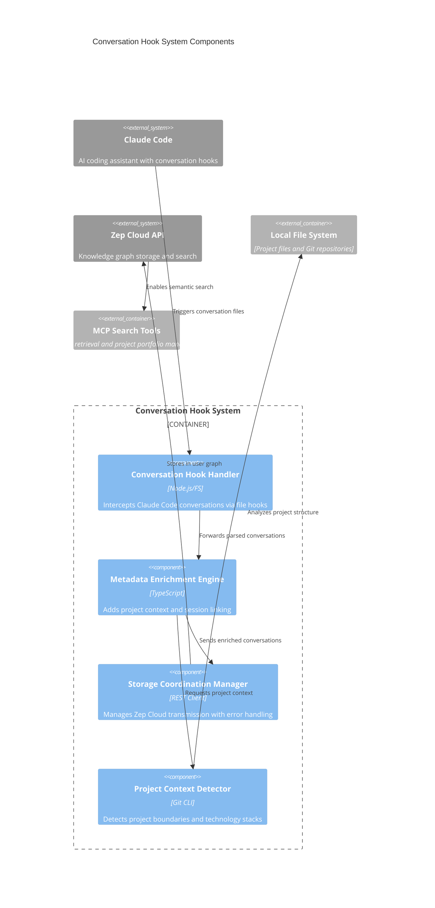

# Conversation Hook System Components

## Component Overview
The Conversation Hook System provides transparent, automatic capture of Claude Code conversations with intelligent project context detection and metadata enrichment. This system operates passively through file-based hooks, requiring zero user intervention while building rich conversational knowledge graphs.

## Architectural Components (Major functional areas)

### **Conversation Hook Handler**
- **Responsibility**: Intercepts and processes Claude Code conversation events through file-based triggers
- **Technology**: Node.js with File System watchers and JSON processing
- **Interfaces**: 
  - File system hooks (`/home/uptown/.claude/temporal-bridge-debug-*.json`)
  - JSON conversation parsing
  - Event-driven processing pipeline

### **Metadata Enrichment Engine**
- **Responsibility**: Enriches conversations with project context, session linking, and technology associations
- **Technology**: TypeScript analysis engine with Git integration
- **Interfaces**:
  - Project context API
  - Session management system
  - Technology detection algorithms
  - Entity relationship mapping

### **Storage Coordination Manager**
- **Responsibility**: Manages conversation transmission to Zep Cloud with error handling and retry logic
- **Technology**: REST API client with exponential backoff and circuit breaker patterns
- **Interfaces**:
  - Zep Cloud API integration
  - User graph storage coordination
  - Batch processing pipeline
  - Failure recovery mechanisms

### **Project Context Detector**
- **Responsibility**: Automatically detects project boundaries, technology stacks, and organizational context
- **Technology**: Git CLI integration with file system analysis and pattern recognition
- **Interfaces**:
  - Git repository analysis
  - Package.json technology detection
  - File extension pattern matching
  - Project entity creation

## Component Diagram

## Component Interactions

### **Automatic Capture Workflow**
1. **Hook Trigger**: Claude Code writes conversation debug files to `~/.claude/temporal-bridge-debug-*.json`
2. **Event Processing**: Hook Handler detects file changes and parses conversation JSON
3. **Context Analysis**: Project Context Detector analyzes current working directory for Git repo, package.json, and technology patterns
4. **Metadata Enrichment**: Enrichment Engine adds project associations, session IDs, and technology relationships
5. **Storage Coordination**: Storage Manager transmits enriched conversations to Zep user graph with error handling

### **Project Context Detection Pattern**
- **Git Analysis**: Extracts repository URL, branch, and organization context
- **Technology Detection**: Scans package.json dependencies, file extensions, and framework configurations
- **Confidence Scoring**: Assigns confidence levels to detected technologies based on usage patterns
- **Entity Creation**: Generates semantic relationships (developer WORKS_ON project, project USES technology)

### **Error Recovery Mechanisms**
- **Network Failures**: Exponential backoff with circuit breaker for Zep API connectivity
- **Parsing Errors**: Graceful handling of malformed conversation JSON with logging
- **Context Failures**: Fallback to directory-based project detection when Git analysis fails
- **Storage Failures**: Retry queue with persistent failure logging for manual intervention

### **Session Continuity Features**
- **Thread Linking**: Maintains conversation thread associations across multiple sessions
- **Project Associations**: Links conversations to detected projects for contextual search
- **Technology Tracking**: Creates implicit expertise relationships through conversation content analysis
- **Temporal Indexing**: Enables chronological conversation retrieval and pattern analysis