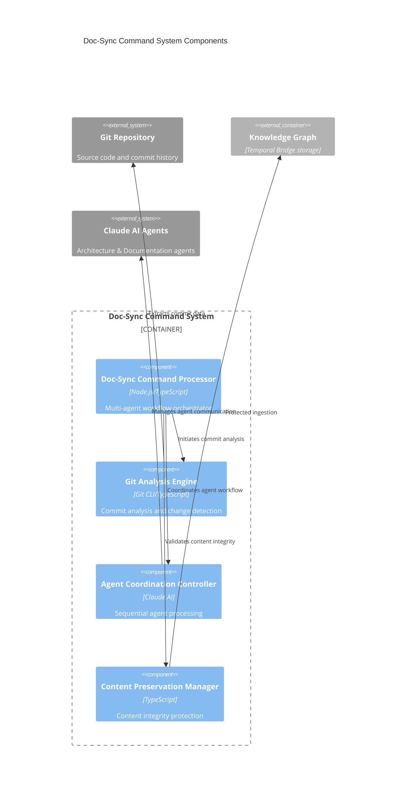

# Doc-Sync Command System Components

## Component Overview
The Doc-Sync Command System implements a sophisticated multi-agent coordination architecture for automated documentation synchronization. The system processes Git commits through a 4-phase workflow, utilizing specialized agents to analyze architectural changes and generate synchronized documentation while preserving content integrity.

## Architectural Components (Major functional areas)

### **Doc-Sync Command Processor**
- **Responsibility**: Multi-agent coordination orchestrator that manages the complete documentation synchronization workflow
- **Technology**: Node.js/TypeScript with Claude AI integration
- **Interfaces**: Git commit analysis, agent coordination, workflow state management
- **Key Functions**: Orchestrates 4-phase processing, manages agent communication, ensures sequential processing with context preservation

### **Git Analysis Engine**
- **Responsibility**: Commit data extraction and architectural change detection from Git history
- **Technology**: Git CLI integration with TypeScript
- **Interfaces**: Git repository access, commit parsing, file change detection
- **Key Functions**: Extracts commit metadata, identifies architectural changes, determines scope of documentation updates needed

### **Agent Coordination Controller**
- **Responsibility**: Sequential agent processing with context preservation and inter-agent communication
- **Technology**: Claude AI API with structured communication protocols
- **Interfaces**: Architecture Agent communication, Documentation Generator coordination, context preservation
- **Key Functions**: Manages agent handoffs, preserves context between phases, handles agent failure recovery

### **Content Preservation Manager**
- **Responsibility**: Critical component ensuring agent-generated content is never rewritten during knowledge graph ingestion
- **Technology**: Content integrity validation and workflow protection
- **Interfaces**: Documentation validation, ingestion workflow control, content integrity checks
- **Key Functions**: Validates generated content, prevents overwrites, ensures documentation consistency

## Component Diagram

## Component Interactions

### 4-Phase Processing Workflow

**Phase 1: Git Analysis**
- Git Analysis Engine extracts commit metadata and identifies architectural changes
- Determines scope and impact of changes requiring documentation updates
- Provides context for subsequent agent processing phases

**Phase 2: Architecture Agent Evaluation**
- Agent Coordination Controller invokes Architecture Agent with Git analysis context
- Architecture Agent evaluates changes and provides CREATE/UPDATE recommendations
- Context preserved for handoff to Documentation Generator phase

**Phase 3: Documentation Generation**
- Documentation Generator Agent receives Architecture Agent recommendations
- Generates new documentation or updates existing files based on recommendations
- Agent coordination ensures proper context flow between specialized agents

**Phase 4: Knowledge Graph Synchronization**
- Content Preservation Manager validates generated documentation
- Protected ingestion ensures agent-generated content is never rewritten
- Maintains documentation consistency across knowledge graph updates

### Critical Workflow Improvements

**Content Preservation Protocol**
- Never rewrite agent-generated content during ingestion
- Validation checks prevent accidental content overwrites
- Ensures documentation integrity across automated updates

**Sequential Agent Processing**
- Architecture Agent → Documentation Generator handoff with full context
- Error recovery patterns for graceful agent failure handling
- Context preservation maintains workflow continuity across agent transitions

**Multi-Agent Communication Patterns**
- Structured communication protocols between specialized agents
- Context preservation ensures information flow integrity
- Agent coordination prevents duplicate work and ensures consistency