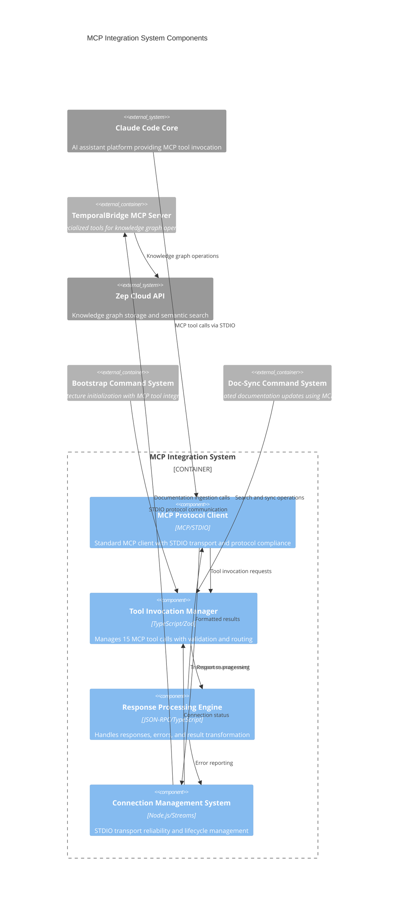

# MCP Integration System Components

## Component Overview
The MCP Integration System implements client-side Model Context Protocol integration, managing communication with the TemporalBridge MCP Server through STDIO transport. This system orchestrates 15 specialized MCP tools for knowledge graph operations, providing reliable protocol communication and error handling for bootstrap, doc-sync, and search workflows.

## Architectural Components (Major functional areas)

### **MCP Protocol Client**
- **Responsibility**: Standard MCP client implementation with STDIO transport protocol compliance
- **Technology**: TypeScript, MCP Protocol Specification, STDIO
- **Interfaces**: Protocol message handling, transport initialization, capability negotiation
- **Key Functions**: Protocol handshake, tool discovery, message serialization, transport management

### **Tool Invocation Manager**
- **Responsibility**: Manages calls to 15 TemporalBridge MCP tools with parameter validation and routing
- **Technology**: TypeScript, Zod validation, MCP tool registry
- **Interfaces**: Tool call routing, parameter validation, response coordination, error propagation
- **Key Functions**: Knowledge graph operations, search orchestration, documentation ingestion workflows

### **Response Processing Engine**
- **Responsibility**: Handles MCP tool responses with error management and result transformation
- **Technology**: TypeScript, JSON-RPC, structured error handling
- **Interfaces**: Response parsing, error classification, result formatting, success validation
- **Key Functions**: Response validation, error recovery, result aggregation, format standardization

### **Connection Management System**
- **Responsibility**: Maintains STDIO transport reliability and connection lifecycle management
- **Technology**: Node.js Process Management, STDIO Streams, Connection Pooling
- **Interfaces**: Transport reliability, connection monitoring, retry logic, graceful shutdown
- **Key Functions**: Connection health monitoring, automatic reconnection, transport error handling

## Component Diagram

## Tool Integration Patterns

### **Knowledge Graph Operations**
- **`ingest_documentation`** - Primary tool for knowledge graph updates during bootstrap and sync
- **`search_graph_nodes`** - Entity search for architecture discovery
- **`search_graph_edges`** - Relationship queries for component analysis
- **`search_with_filters`** - Advanced filtered search with metadata constraints
- **`find_component_docs`** - Component-specific documentation retrieval

### **Personal & Project Memory**
- **`search_personal`** - Developer-specific conversation history search
- **`search_project`** - Shared project knowledge queries
- **`search_all`** - Combined search across personal and project knowledge graphs
- **`share_knowledge`** - Curated knowledge transfer from personal to project graphs

### **Context & Session Management**
- **`get_recent_episodes`** - Recent conversation context for session continuity
- **`get_current_context`** - Active session metadata and project context
- **`get_thread_context`** - Thread-specific conversation analysis
- **`list_projects`** - Project portfolio overview and metadata

### **Project Intelligence**
- **`project_context`** - Current project entity information
- **`project_technologies`** - Technology stack analysis and confidence scoring
- **`get_technology_expertise`** - Cross-project skill and expertise analysis

## Integration Workflows

### **Bootstrap Integration Workflow**
1. **Tool Discovery** - Protocol client negotiates capabilities with MCP server
2. **Documentation Generation** - Bootstrap system creates architecture documentation
3. **Graph Ingestion** - `ingest_documentation` calls for each generated document
4. **Validation** - Response processing validates successful ingestion
5. **Error Recovery** - Connection management handles any transport failures

### **Doc-Sync Integration Workflow**
1. **Context Search** - `search_graph_nodes` and `search_graph_edges` for existing architecture
2. **Change Analysis** - `find_component_docs` to identify documentation requiring updates
3. **Content Updates** - Generated content processed through response engine
4. **Re-ingestion** - `ingest_documentation` with updated content and metadata
5. **Validation** - Ensures content integrity and successful knowledge graph updates

### **Search Operations Workflow**
1. **Query Preparation** - Tool manager validates search parameters and filters
2. **Multi-source Search** - `search_all` combines personal and project knowledge
3. **Result Processing** - Response engine aggregates and formats search results
4. **Context Integration** - Results integrated with session context for continuity
5. **Error Handling** - Connection management ensures reliable search operations

## Component Interactions

### **Protocol Communication Flow**
- **Handshake** - Protocol client establishes MCP connection with capability negotiation
- **Tool Registration** - Server advertises 15 available tools with metadata and schemas
- **Request Routing** - Tool manager routes calls to appropriate server-side coordinators
- **Response Handling** - Response engine processes JSON-RPC responses with error classification

### **Error Handling & Reliability**
- **Transport Errors** - Connection management handles STDIO transport failures with retry logic
- **Protocol Errors** - Response engine classifies MCP protocol errors and provides recovery
- **Tool Errors** - Tool manager handles tool-specific errors with appropriate fallbacks
- **Timeout Management** - Connection system manages request timeouts and cancellation

### **Performance Optimization**
- **Connection Reuse** - Connection management maintains persistent STDIO connections
- **Response Caching** - Context information cached for improved performance
- **Batch Operations** - Tool manager supports batched operations for efficiency
- **Stream Processing** - Response engine handles streaming responses for large results

## Architecture Benefits

### **Protocol Compliance**
- **MCP Standards** - Full compliance with Model Context Protocol specification
- **Transport Reliability** - Robust STDIO transport with error recovery
- **Tool Discoverability** - Dynamic tool discovery and capability negotiation
- **Version Compatibility** - Forward-compatible protocol implementation

### **Integration Flexibility**
- **System Agnostic** - Works with any MCP-compatible server implementation
- **Tool Extensibility** - Easy addition of new tools without client changes
- **Error Resilience** - Graceful degradation when tools are unavailable
- **Performance Scaling** - Efficient handling of concurrent tool operations

### **Development Experience**
- **Type Safety** - Full TypeScript integration with MCP protocol types
- **Error Transparency** - Clear error messages and debugging information
- **Testing Support** - Components designed for independent unit testing
- **Monitoring Integration** - Comprehensive logging and performance metrics