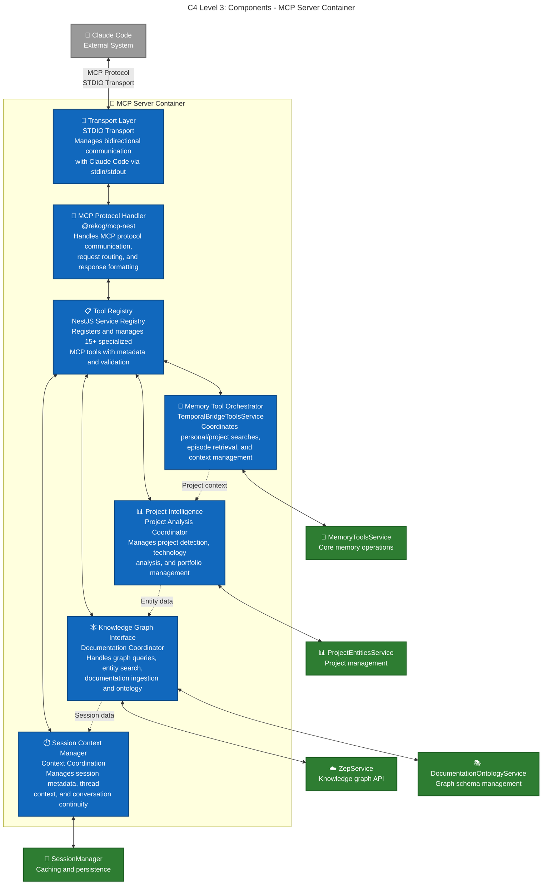

## MCP Tool Categories (15 Available)

### **Personal Memory Tools**
- **`search_personal`** - Search personal conversation history
- **`get_recent_episodes`** - Recent conversation context
- **`get_current_context`** - Current session information

### **Project Knowledge Tools**  
- **`search_project`** - Search shared project knowledge
- **`search_all`** - Combined personal + project search
- **`share_knowledge`** - Curate insights to project groups
- **`list_projects`** - Project portfolio overview
- **`project_context`** - Current project details
- **`project_technologies`** - Technology breakdown analysis

### **Knowledge Graph Tools**
- **`search_graph_nodes`** - Search entity summaries and attributes
- **`search_graph_edges`** - Search relationships and facts
- **`search_with_filters`** - Advanced search with filters
- **`find_component_docs`** - Component documentation lookup
- **`ingest_documentation`** - Add docs to knowledge graph

### **Context Management Tools**
- **`get_thread_context`** - Thread-specific conversation analysis
- **`get_technology_expertise`** - Cross-project skill analysis

## Component Responsibilities

### **MCP Protocol Handler**
- **Request Routing** - Routes tool calls to appropriate coordinators
- **Response Formatting** - Ensures MCP protocol compliance
- **Error Handling** - Manages protocol-level errors and retries
- **Metadata Management** - Handles tool metadata and capabilities

### **Tool Registry** 
- **Tool Registration** - Registers all 15 MCP tools with NestJS
- **Parameter Validation** - Validates input parameters using Zod schemas
- **Tool Discovery** - Provides tool metadata to Claude Code
- **Lifecycle Management** - Manages tool initialization and cleanup

### **Memory Tool Orchestrator**
- **Search Coordination** - Orchestrates personal, project, and combined searches  
- **Context Assembly** - Builds comprehensive context from multiple sources
- **Episode Management** - Handles conversation history and threading
- **Result Formatting** - Formats search results with appropriate metadata

### **Project Intelligence**
- **Project Detection** - Analyzes current project context
- **Technology Analysis** - Identifies and scores technology usage
- **Portfolio Management** - Tracks projects and expertise across sessions
- **Entity Processing** - Creates and manages project entities

### **Knowledge Graph Interface** 
- **Graph Queries** - Coordinates node, edge, and filtered searches
- **Documentation Ingestion** - Processes and classifies documentation
- **Ontology Management** - Ensures proper entity classification
- **Relationship Traversal** - Manages graph relationship queries

### **Session Context Manager**
- **Thread Tracking** - Maintains conversation thread context
- **Session Persistence** - Manages session metadata and caching
- **Context Continuity** - Ensures seamless experience across sessions
- **Metadata Enrichment** - Adds project and context metadata to conversations

### **Transport Layer**
- **STDIO Communication** - Manages stdin/stdout with Claude Code
- **Message Parsing** - Parses incoming MCP protocol messages
- **Response Streaming** - Streams responses back to Claude Code
- **Connection Management** - Handles connection lifecycle and errors

## Architectural Benefits

### **Separation of Concerns**
- **Protocol vs Business Logic** - Clean separation between MCP protocol handling and domain logic
- **Tool Organization** - Logical grouping of related tools by domain area
- **Service Coordination** - Each coordinator focuses on specific domain expertise
- **Error Isolation** - Component failures don't cascade across the system

### **Scalability Patterns**
- **Horizontal Tool Addition** - Easy to add new tools within existing coordinators
- **Service Integration** - Clean dependency injection for new services
- **Caching Optimization** - Session context manager optimizes repeated queries
- **Performance Monitoring** - Each component can be monitored independently

### **Development Experience**
- **Tool Discoverability** - Clear categorization helps users find appropriate tools
- **Type Safety** - Full TypeScript integration with Zod validation
- **Testing Isolation** - Components can be unit tested independently  
- **Debugging Clarity** - Request flow is traceable through components