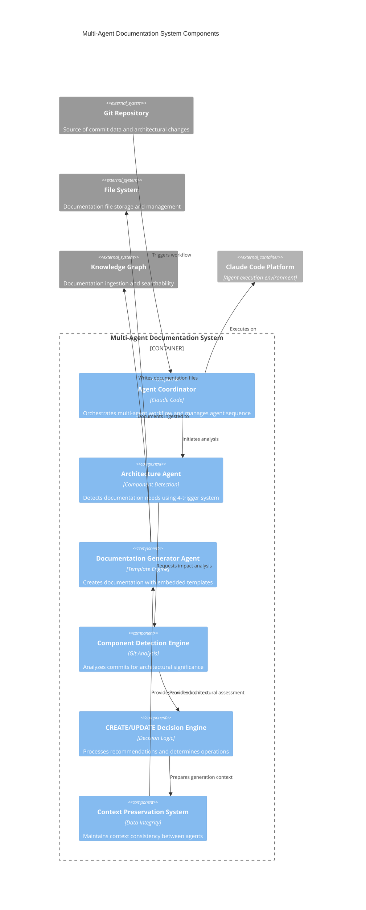

# Multi-Agent Documentation System Container Components

## Component Overview
The Multi-Agent Documentation System provides intelligent, automated documentation generation through sophisticated agent coordination. It orchestrates multiple specialized agents to analyze git commits, detect architectural changes, and generate contextual C4 documentation with embedded templates and schema compliance.

## Architectural Components (Major functional areas)

### **Agent Coordinator**
- **Responsibility**: Orchestrates the complete multi-agent workflow and manages agent invocation sequence
- **Technology**: Claude Code Agent Management with sequential processing
- **Interfaces**: Workflow initiation, agent sequencing, error handling, status reporting

### **Architecture Agent**
- **Responsibility**: Detects documentation needs using 4-trigger system and provides CREATE/UPDATE recommendations
- **Technology**: Component detection algorithms with git analysis capabilities
- **Interfaces**: Git commit analysis, architectural impact assessment, priority classification, context extraction

### **Documentation Generator Agent**
- **Responsibility**: Creates documentation using embedded C4 templates with intelligent content generation
- **Technology**: Template processing engine with schema validation and Mermaid diagram generation
- **Interfaces**: Template selection, content generation, schema compliance validation, file creation

### **Component Detection Engine**
- **Responsibility**: Analyzes git commits for architectural significance and component changes
- **Technology**: File pattern analysis with technology stack detection
- **Interfaces**: Commit parsing, file impact assessment, technology identification, relationship mapping

### **CREATE/UPDATE Decision Engine**
- **Responsibility**: Processes agent recommendations and determines specific documentation operations needed
- **Technology**: Decision logic processing with priority-based operation scheduling
- **Interfaces**: Recommendation parsing, operation classification, priority scheduling, dependency resolution

### **Context Preservation System**
- **Responsibility**: Maintains architectural context consistency between agent invocations and operations
- **Technology**: Context serialization with data integrity validation
- **Interfaces**: Context capture, data preservation, consistency validation, context injection

## Component Diagram

## Component Interactions
The workflow begins when the Agent Coordinator receives git commit triggers and initiates the Architecture Agent for impact analysis. The Architecture Agent coordinates with the Component Detection Engine to assess architectural significance and passes findings to the CREATE/UPDATE Decision Engine. The Decision Engine processes recommendations and works with the Context Preservation System to maintain consistency as the Documentation Generator Agent creates contextual documentation. All components operate through sequential processing with built-in error recovery, ensuring reliable documentation generation that maintains C4 methodology compliance and schema validation throughout the multi-agent coordination process.