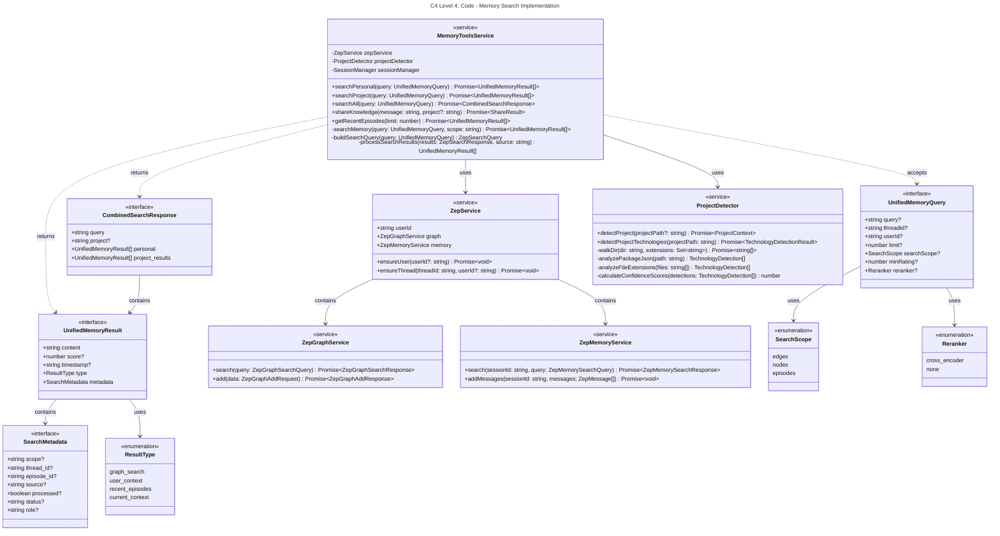

## Core Search Algorithm Flow

The MemoryToolsService implements a sophisticated search pipeline:

1. **Query Parsing & Validation** - Parse UnifiedMemoryQuery parameters and validate inputs
2. **Project Context Detection** - Use ProjectDetector to identify current project context
3. **Search Query Building** - Transform query into Zep-compatible search parameters with filters
4. **Scope-based Execution** - Execute search against personal user graph or project groups
5. **Result Processing & Ranking** - Process raw Zep responses into structured results
6. **Reranking (Optional)** - Apply cross-encoder reranking for improved relevance
7. **Result Formatting** - Return as UnifiedMemoryResult[] with rich metadata

## API Integration Strategy

The ZepService provides a unified interface to Zep Cloud:

- **Single User Identity** - All projects use same developer ID for cross-project learning
- **Thread Management** - Automatic user/thread creation for conversations
- **Dual Search APIs** - Graph search for relationships, memory search for episodes  
- **Error Handling** - Robust error handling with automatic retry logic
- **Type Safety** - Full TypeScript integration with proper interfaces

## Technology Detection Pipeline

The ProjectDetector analyzes projects systematically:

1. **Package.json Analysis** - Extract dependencies, devDependencies, scripts
2. **File Extension Scanning** - Recursive directory walk with pattern matching
3. **Framework Detection** - Identify Next.js, Vue, Angular, etc. configurations
4. **Confidence Calculation** - Weighted scoring based on detection strength
5. **Threshold Filtering** - Remove low-confidence detections
6. **Sorted Results** - Return technologies ranked by confidence and usage