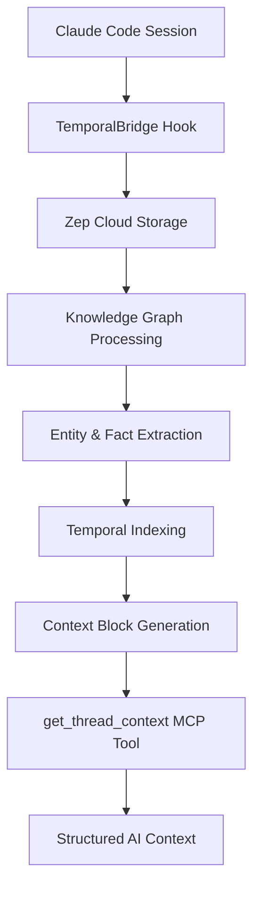

# Context Block Usage Guide

## **What is the Context Block?**

The Context Block is Zep's **intelligent, structured summary** of conversation context. It's designed for AI-to-AI communication and provides rich semantic information in a standardized format.

## **Format Structure - Real Example from Our Current Session**

```
FACTS and ENTITIES, and EPISODES represent relevant context to the current conversation.

# These are the most relevant facts and their valid date ranges
# format: FACT (Date range: from - to)
<FACTS>
  - developer is running a command and waiting for Claude Code to finish (2025-08-27 19:05:52 - present)
  - The developer user and Claude Code assistant participate together in the conversation transaction. (2025-08-13 06:21:26 - 2025-08-13 06:29:57)
  - developer is working with Zep to build persistent memory for AI conversations using Zep's knowledge graph (2025-08-13 06:38:41 - present)
  - Many nodes are connected to the developer, including many things connected to Claude Code. (2025-08-13 06:29:57 - present)
  - The developer user is created and managed in Zep by store_conversation.ts (2025-08-13 06:42:00 - present)
  - The 'developer' node is isolated and represents the user in Zep's system (2025-08-13 06:10:08 - 2025-08-13 06:29:57)
  - developer wants to interface with Zep in different ways (2025-08-13 07:32:42 - present)
</FACTS>

# These are the most relevant entities
# Name: ENTITY_NAME
# Label: entity_label (if present)
# Attributes: (if present)
#   attr_name: attr_value
# Summary: entity summary
<ENTITIES>
  - Name: Zep
    Label: Organization
    Attributes:
      industry: temporal knowledge graph platform
      organization_type: company
    Summary: Zep is a company specializing in temporal knowledge graph solutions, with its industry focused on temporal knowledge graph platforms. The recent implementation has successfully resolved issues with context retrieval, specifically ensuring that the getUserContext tool now provides a structured format including FACTS, ENTITIES, and EPISODES sections.
  
  - Name: Claude Code
    Label: Assistant
    Attributes:
      assistant_name: Claude Code
    Summary: Claude Code, an assistant, successfully pushed documentation updates and resolved several issues. This included fixing graphId vs userId parameter for project searches and implementing get_thread_context using Zep's API for semantic context.
  
  - Name: developer
    Label: User
    Attributes:
      email: developer@example.com
      first_name: Developer
      role_type: user
      user_id: developer
    Summary: The developer works on the zabaca-temporal-bridge project. This project uses Deno and TypeScript and belongs to zabaca.
</ENTITIES>

# These are the most relevant episodes
<EPISODES>
  - Claude Code (assistant): Perfect! Now let's test the corrected implementation:
  - Claude Code (assistant): Great! The cleanup removes: ✅ raw_response - Duplicated the same content as context_block ✅ context_summary - Redundant with context_block ✅ facts: [] - Empty array that wasn't being used
</EPISODES>
```

## **Our Implementation**

### **How We Access It**
```typescript
const threadContext = await zepService.thread.getUserContext(threadId, {
  mode: 'basic' // Returns structured FACTS/ENTITIES/EPISODES format
});

const contextBlock = threadContext.context;
```

### **Real Example from Our Current Session**
When we call `get_thread_context` with our current session, we get:

```json
{
  "thread_id": "claude-code-fae3b4dc-56ed-4f64-82f3-4a724998b0b1",
  "context_block": "FACTS and ENTITIES, and EPISODES represent relevant context to the current conversation.\n\n# These are the most relevant facts and their valid date ranges\n# format: FACT (Date range: from - to)\n<FACTS>\n  - developer is running a command and waiting for Claude Code to finish (2025-08-27 19:05:52 - present)\n  - The developer user and Claude Code assistant participate together in the conversation transaction. (2025-08-13 06:21:26 - 2025-08-13 06:29:57)\n  - developer is working with Zep to build persistent memory for AI conversations using Zep's knowledge graph (2025-08-13 06:38:41 - present)\n  - Many nodes are connected to the developer, including many things connected to Claude Code. (2025-08-13 06:29:57 - present)\n  - The developer user is created and managed in Zep by store_conversation.ts (2025-08-13 06:42:00 - present)\n  - The 'developer' node is isolated and represents the user in Zep's system (2025-08-13 06:10:08 - 2025-08-13 06:29:57)\n  - developer wants to interface with Zep in different ways (2025-08-13 07:32:42 - present)\n</FACTS>\n\n# These are the most relevant entities\n<ENTITIES>\n  - Name: Zep\n    Label: Organization\n    Attributes:\n      industry: temporal knowledge graph platform\n      organization_type: company\n    Summary: Zep is a company specializing in temporal knowledge graph solutions, with its industry focused on temporal knowledge graph platforms. The recent implementation has successfully resolved issues with context retrieval, specifically ensuring that the getUserContext tool now provides a structured format including FACTS, ENTITIES, and EPISODES sections.\n  \n  - Name: Claude Code\n    Label: Assistant\n    Attributes:\n      assistant_name: Claude Code\n    Summary: Claude Code, an assistant, successfully pushed documentation updates and resolved several issues. This included fixing graphId vs userId parameter for project searches and implementing get_thread_context using Zep's API for semantic context.\n  \n  - Name: developer\n    Label: User\n    Attributes:\n      email: developer@example.com\n      first_name: Developer\n      role_type: user\n      user_id: developer\n    Summary: The developer works on the zabaca-temporal-bridge project. This project uses Deno and TypeScript and belongs to zabaca.\n</ENTITIES>\n\n# These are the most relevant episodes\n<EPISODES>\n  - Claude Code (assistant): Perfect! Now let's test the corrected implementation:\n  - Claude Code (assistant): Great! The cleanup removes: ✅ raw_response - Duplicated the same content as context_block ✅ context_summary - Redundant with context_block ✅ facts: [] - Empty array that wasn't being used\n</EPISODES>",
  "user_id": "developer",
  "timestamp": "2025-08-31T17:10:08.527Z"
}
```

**Key Insights from Our Real Context:**

1. **Temporal Tracking**: Facts show our collaboration spans from August 13th to present
2. **Entity Relationships**: Zep understands Claude Code (Assistant), developer (User), and Zep (Organization) 
3. **Project Context**: Recognizes we're working on zabaca-temporal-bridge with TypeScript/Deno
4. **Recent Episodes**: Captures our actual conversation about cleaning up the MCP response
5. **Cross-Session Memory**: References work from weeks ago while staying relevant to current discussion

## **Key Benefits for AI Collaboration**

### **1. Temporal Understanding**
- **Date Ranges**: Every fact includes validity periods (from → to)
- **Timeline Context**: Understand when things happened and evolved
- **Current vs Historical**: Distinguish between active and expired information

### **2. Entity Relationships**  
- **Structured Summaries**: Rich descriptions of people, tools, concepts
- **Attributes**: Key-value pairs for entity properties
- **Labels**: Categorization (User, Assistant, Organization, Tool, etc.)

### **3. Conversation Context**
- **Episodes**: Relevant conversation excerpts  
- **Cross-Session**: Context spans multiple conversation threads
- **Intelligent Filtering**: Only most relevant information included

## **Practical Use Cases**

### **Session Continuity**
```typescript
// Start new session by loading previous context
const context = await getThreadContext(previousSessionId);
// Now I understand: "We were debugging the graphId vs userId issue..."
```

### **Problem-Solution Patterns**
```typescript
// When encountering similar issues
// Context shows: "We solved similar authentication patterns on 2024-08-15..."
// Can immediately apply learned solutions
```

### **Project Intelligence**
```typescript
// Understand project relationships
// ENTITIES show: "TemporalBridge USES TypeScript", "developer WORKS_ON zabaca-temporal-bridge"
// FACTS show: "Project migrated from Deno to Node.js (2025-08-31 05:30:45 - present)"
```

## **Current Limitations & Future Improvements**

### **✅ What Works Now**
- **Rich structured format** with FACTS/ENTITIES/EPISODES
- **Temporal date ranges** for all facts
- **Cross-session context** from entire user graph  
- **Intelligent relevance scoring** by Zep's LLM
- **Entity relationship extraction** automatically generated

### **🔄 Areas for Enhancement**
1. **Project-Specific Context**: Currently only works for user graphs, not project groups
2. **Custom Entity Types**: Could define domain-specific entities (Bug, Feature, Architecture Decision)
3. **Confidence Scoring**: Facts could include confidence/reliability ratings
4. **Interactive Queries**: Could ask follow-up questions about specific entities or facts

### **🎯 Integration Opportunities** 
1. **Proactive Context Loading**: Automatically load context at session start
2. **Pattern Recognition**: Identify recurring issues and solutions across sessions
3. **Intelligent Suggestions**: Use context to anticipate needs and recommend approaches
4. **Cross-Project Learning**: Apply solutions from one project to similar issues in another

## **Technical Architecture**



## **Implementation Status**

- ✅ **Basic Context Retrieval**: Working with structured FACTS/ENTITIES/EPISODES
- ✅ **MCP Tool Integration**: Available via `get_thread_context`
- ✅ **Conversation Storage**: Automatic via Claude Code hooks
- ✅ **Cross-Session Access**: Can retrieve context from any previous thread
- ⚠️ **Project Context**: Limited to user graphs (feature request submitted to Zep)
- ❌ **Proactive Loading**: Manual invocation required
- ❌ **Custom Entities**: Using default Zep entity extraction

## **Next Steps**

1. **Enhance Hook Integration**: Proactively load context at session start
2. **Build Pattern Recognition**: Analyze context for recurring solutions
3. **Create Context-Aware Tools**: Use context to improve all MCP tool responses  
4. **Implement Smart Caching**: Cache context blocks for faster access
5. **Add Custom Entities**: Define development-specific entity types
6. **Cross-Project Context**: Build bridge until Zep adds project graph context support

The Context Block represents a major step toward **truly intelligent, context-aware AI collaboration** that builds on accumulated knowledge and learned patterns over time! 🧠✨