# TemporalBridge Roadmap: Universal AI Memory System

## Vision Statement

Transform TemporalBridge from Claude Code memory into the **Universal AI Memory System** that solves software development's $650 billion knowledge crisis. Make every AI coding conversation part of a larger, evolving architectural understanding that prevents knowledge loss and enables intelligent, context-aware development across all AI tools.

## Strategic Goals

### 🎯 **Primary Mission**
Enable AI coding agents (Claude Code, GitHub Copilot, Cursor, etc.) to develop with **full architectural context** rather than coding blindly, while automatically maintaining up-to-date system documentation.

### 📈 **Success Vision**
- 80% reduction in "blind coding" incidents across all AI tools
- 50% reduction in architecture documentation maintenance burden
- 40% faster resolution of architectural questions and issues
- Universal memory that works seamlessly across the entire AI coding ecosystem

## Two-Phase Implementation Strategy

Our roadmap is built around **two complementary systems** that together create the foundation for universal AI memory:

---

## 🔄 Phase 1: Automated Architecture Documentation System

> **Transform documentation from a maintenance burden into an automated intelligence system**

### [📋 Full Roadmap: Automated Architecture Documentation](./automated-architecture-docs.md)

**Problem Solved:** Architecture documentation becomes stale immediately, leaving AI agents and developers without current system context.

**Solution:** Git-triggered system that automatically detects architectural changes and generates/updates documentation.

### **Key Components:**
1. **Git Change Analysis Engine** - Monitor commits for architectural modifications
2. **Documentation Generation Pipeline** - Auto-create C4 diagrams, ADRs, component docs
3. **Knowledge Graph Integration** - Store all architectural knowledge in searchable format
4. **Change Notification System** - Alert teams to architectural updates

### **Timeline:** 12-16 weeks (Q1-Q2 2025)
**Impact:** 100% architectural changes automatically documented, 70% increase in documentation accuracy

---

## 🔍 Phase 2: Intelligent Architecture Search System

> **Create an architectural oracle that provides instant context to AI agents and developers**

### [📋 Full Roadmap: Intelligent Architecture Search](./intelligent-architecture-search.md)

**Problem Solved:** AI coding agents and developers lack easy access to architectural knowledge, leading to inconsistent decisions and repeated questions.

**Solution:** Sophisticated search system that delivers context-aware architectural guidance through natural language queries.

### **Key Components:**
1. **Semantic Architecture Index** - Comprehensive, searchable architectural knowledge base
2. **Context-Aware Query Engine** - Natural language architectural questions with intelligent responses
3. **Proactive Architecture Assistant** - Real-time guidance during development
4. **Developer Experience Interface** - Seamless integration with AI coding tools

### **Timeline:** 16-20 weeks (Q2-Q3 2025)
**Impact:** 80% reduction in blind coding, 90% developer satisfaction with architectural knowledge access

---

## Integrated System Architecture

```mermaid
---
title: "Universal AI Memory System Architecture"
---
flowchart TB
    %% Input Sources
    GIT[🔄 Git Commits<br/>Architecture Changes]
    AI_AGENTS[🤖 AI Coding Agents<br/>Claude Code, Copilot, Cursor]
    DEVS[👤 Developers<br/>Questions & Context Needs]
    
    %% Phase 1: Automated Documentation
    subgraph PHASE1["🔄 Phase 1: Automated Architecture Docs"]
        ANALYSIS[Git Analysis Engine<br/>Detect architectural changes]
        GENERATION[Documentation Pipeline<br/>Auto-generate docs & diagrams]
        INGESTION[Knowledge Graph Integration<br/>Store in searchable format]
    end
    
    %% Phase 2: Intelligent Search
    subgraph PHASE2["🔍 Phase 2: Intelligent Search"]
        INDEX[Semantic Architecture Index<br/>Comprehensive knowledge base]
        QUERY[Context-Aware Query Engine<br/>Natural language queries]
        ASSISTANT[Proactive Architecture Assistant<br/>Real-time guidance]
    end
    
    %% Storage & Intelligence
    KNOWLEDGE_GRAPH[🧠 Zep Knowledge Graph<br/>Universal AI Memory<br/>Cross-tool architectural knowledge]
    
    %% Outputs & Benefits
    CONTEXT[🎯 Contextual AI Development<br/>No more blind coding]
    DOCS[📚 Always-Current Documentation<br/>Zero maintenance burden]
    ONBOARDING[🚀 Instant Architectural Understanding<br/>For teams & AI agents]
    
    %% Connections
    GIT --> ANALYSIS
    ANALYSIS --> GENERATION
    GENERATION --> INGESTION
    INGESTION --> KNOWLEDGE_GRAPH
    
    KNOWLEDGE_GRAPH --> INDEX
    INDEX --> QUERY
    QUERY --> ASSISTANT
    
    AI_AGENTS --> ASSISTANT
    DEVS --> QUERY
    
    ASSISTANT --> CONTEXT
    GENERATION --> DOCS
    QUERY --> ONBOARDING
    
    %% Styling
    classDef phase1 fill:#e1f5fe,stroke:#01579b,stroke-width:2px
    classDef phase2 fill:#f3e5f5,stroke:#4a148c,stroke-width:2px
    classDef storage fill:#e8f5e8,stroke:#1b5e20,stroke-width:2px
    classDef benefit fill:#fff3e0,stroke:#e65100,stroke-width:2px
    
    class ANALYSIS,GENERATION,INGESTION phase1
    class INDEX,QUERY,ASSISTANT phase2
    class KNOWLEDGE_GRAPH storage
    class CONTEXT,DOCS,ONBOARDING benefit
```

## Timeline & Dependencies

### **Q1 2025: Foundation Phase**
- **Weeks 1-6:** Automated Architecture Documentation System (Phase 1 Core)
- **Milestone:** Git-triggered documentation generation working
- **Deliverable:** Auto-generated C4 diagrams and ADRs for TemporalBridge

### **Q2 2025: Integration Phase** 
- **Weeks 7-12:** Complete Phase 1 with advanced features
- **Weeks 13-16:** Begin Phase 2 foundation (search infrastructure)
- **Milestone:** Full automated documentation pipeline + basic architectural search
- **Deliverable:** Complete architectural knowledge automatically maintained and queryable

### **Q3 2025: Intelligence Phase**
- **Weeks 17-24:** Complete Phase 2 with advanced AI assistance
- **Milestone:** Proactive architectural guidance for AI coding agents
- **Deliverable:** Universal AI memory system ready for multi-tool integration

### **Q4 2025: Universal Expansion**
- **Multi-Tool Integration:** GitHub Copilot, Cursor adapters
- **Enterprise Features:** Team collaboration, compliance reporting
- **Community:** Open-source ecosystem for AI tool integrations

## Success Metrics & Validation

### **Phase 1 Success Criteria**
- ✅ 100% architectural changes automatically detected and documented
- ✅ 70% increase in documentation accuracy and freshness  
- ✅ 50% reduction in manual documentation maintenance time
- ✅ Complete knowledge graph coverage of system architecture

### **Phase 2 Success Criteria**
- ✅ 80% reduction in "blind coding" incidents from AI agents
- ✅ 90% developer satisfaction with architectural knowledge access
- ✅ 40% faster resolution of architectural questions
- ✅ 95% accuracy in architectural query responses

### **Universal AI Memory Success**
- ✅ Cross-tool architectural knowledge sharing working
- ✅ 60% improvement in AI agent architectural consistency
- ✅ 75% reduction in repeated architectural questions across tools
- ✅ Foundation established for enterprise expansion

## Resource Requirements

### **Core Team (2 Engineers)**
- **Senior Engineer:** Git analysis, documentation generation, knowledge graph integration
- **Full-Stack Engineer:** Search interface, MCP tools, developer experience features

### **Technology Infrastructure**
- Existing TemporalBridge MCP and Zep integration
- Git repository access and webhook capabilities  
- AST parsing libraries for architectural analysis
- Mermaid/diagram generation tools

### **Validation Environment**
- TemporalBridge repository as primary test case
- Additional open-source projects for validation
- Beta testing with development teams
- Integration testing with multiple AI coding tools

## Strategic Impact

### **Immediate Value (6 months)**
- TemporalBridge architecture automatically documented and searchable
- AI agents can develop with full architectural context
- Development team productivity significantly improved

### **Medium-term Impact (12 months)**  
- Universal AI memory system supporting multiple coding tools
- Enterprise-ready features for team collaboration
- Open-source community adoption and contributions

### **Long-term Vision (18+ months)**
- Industry standard for AI-assisted development with architectural context
- Platform for advanced AI architectural reasoning
- Foundation for automated software architecture intelligence

---

## Getting Started

### **For Contributors**
1. Review detailed roadmaps: [Automated Docs](./automated-architecture-docs.md) | [Intelligent Search](./intelligent-architecture-search.md)
2. Check current development status in project issues
3. Join discussions on architectural approach and implementation

### **For Early Adopters**
- Follow development progress for beta testing opportunities
- Provide feedback on architectural documentation needs
- Test integration with your AI coding workflow

### **For Enterprise Interest**
- Contact team for enterprise roadmap and partnership discussions
- Provide input on team collaboration and compliance requirements
- Pilot program opportunities for large-scale validation

---

**🎯 Mission:** Transform every AI coding conversation into part of a larger, evolving architectural intelligence  
**📅 Timeline:** 18-month journey to Universal AI Memory System  
**🚀 Impact:** Solve the $650B software development knowledge crisis

*Last Updated: September 2025 | Status: Planning Phase*